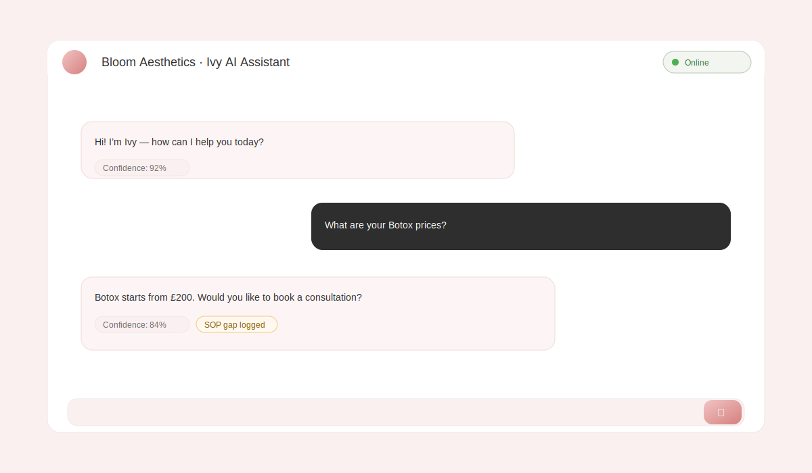
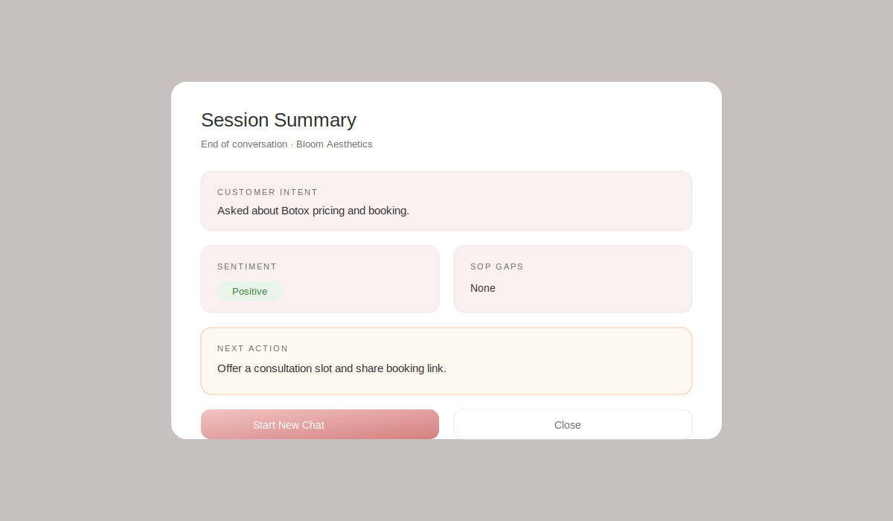

# 🌸 Closira AI Agent — Bloom Aesthetics

> **AI Engineering Internship Assignment**  
> A production-minded AI customer support workflow built with Python + Groq (LLaMA 3.3 70B)

---

## What This Does

This project implements a 4-stage AI customer support workflow for **Bloom Aesthetics Clinic**, an SMB aesthetics business. The AI agent (named **Ivy**) handles inbound customer enquiries with four distinct capabilities:

| Stage | Capability | Description |
|-------|-----------|-------------|
| 1 | **FAQ Answering** | Answers questions using only the SOP JSON — no hallucination |
| 2 | **Lead Qualification** | Asks 3 structured questions to qualify potential customers |
| 3 | **Escalation Detection** | Detects complaints, medical questions, anger, and out-of-scope queries |
| 4 | **Conversation Summary** | Generates a structured CRM-ready summary at session end |

---

## Project Structure

```
closira-agent/
├── app.py                    # Flask web server
├── cli.py                    # Terminal-based CLI runner
├── logs/                      # Local runtime logs (created/used at runtime)
├── sop_data.json             # SOP data for Bloom Aesthetics
├── requirements.txt
├── prompt_design.md          # Full prompt engineering documentation
├── README.md
│
├── static/
│   └── screenshots/           # README screenshots (SVG placeholders)
│
├── src/
│   ├── agent.py              # Core AI logic (all 4 stages)
│   ├── session.py            # Conversation state management
│   ├── workflow.py           # Orchestrator tying all stages together
│   └── logging_utils.py      # Rotating log + JSONL event helpers
│
├── templates/
│   └── index.html            # Web UI (single file, no build step)
│
└── test_transcripts/
    ├── 01_in_sop_question.md
    ├── 02_out_of_scope.md
    ├── 03_escalation_trigger.md
    ├── 04_lead_qualification.md
    └── 05_conversation_summary.md
```

---

## Quick Start

### 1. Prerequisites

- Python 3.9+
- A free [Groq API key](https://console.groq.com) (takes 60 seconds to create)

### 2. Install Dependencies

```bash
pip install -r requirements.txt
```

### 3. Set Your API Key

```bash
# Mac/Linux
export GROQ_API_KEY=your_groq_api_key_here

# Windows (Command Prompt)
set GROQ_API_KEY=your_groq_api_key_here

# Windows (PowerShell)
$env:GROQ_API_KEY="your_groq_api_key_here"
```

### 4a. Run the Web UI (Recommended)

```bash
python app.py
```

Open your browser at **http://localhost:5000**

### 4b. Run the CLI (Terminal)

```bash
python cli.py
```

---

## Web UI Features

- 💬 Full chat interface with typing indicators
- 🌸 Stage progress bar (FAQ → Qualification → Escalation → Summary)
- ⚠️ Visual escalation banners with reason labels
- 📋 Lead qualification badges on qualification questions
- 📈 Confidence score on each AI response
- 🧩 SOP gap indicator when the question is out-of-scope / low-confidence
- 📊 End-of-session summary modal with structured CRM data
- 🔄 New session button
- 💡 Suggestion chips for common questions

---

## Screenshots





---

## Logs Folder

Runtime logs are written to `logs/`:

- `logs/app.log` — rotating application log
- `logs/events.jsonl` — structured event stream (one JSON record per line)
- `logs/sop_gaps.jsonl` — SOP gap detections (for improving SOP coverage)

---

## How to Test Each Scenario

Once the app is running, try these inputs to trigger each stage:

| Scenario | What to type |
|----------|-------------|
| In-SOP question | `"What are your Botox prices?"` |
| Out-of-scope | `"Do you have a loyalty card?"` |
| Escalation (complaint) | `"I'm really disappointed with my last treatment"` |
| Escalation (medical) | `"Is Botox safe if I'm pregnant?"` |
| Escalation (anger) | `"This is absolutely ridiculous!!!"` |
| Escalation (human) | `"I want to speak to a real person"` |
| Lead qualification | Just chat normally — triggers automatically after turn 2 |
| Summary | Click **"End & Summarise"** button |

---

## API Endpoints

| Method | Endpoint | Description |
|--------|----------|-------------|
| `POST` | `/api/start` | Start a new session |
| `POST` | `/api/message` | Send a message `{"message": "...", "session_id": "..."}` |
| `POST` | `/api/summary` | Generate session summary |
| `GET`  | `/api/session?id=...` | Debug: view full session state |

---

## Model & API Choice

This project uses **Groq** with **LLaMA 3.3 70B** (`llama-3.3-70b-versatile`) because:

- **Free API** with generous rate limits for development
- **Extremely fast** inference (Groq's custom silicon)
- LLaMA 3.3 70B follows structured output instructions reliably
- Compatible with OpenAI-style API format (easy to swap providers)

To switch to OpenAI or Anthropic Claude, update `src/agent.py` — the prompt logic is identical.

---

## Hallucination Prevention Summary

Three layers of defence prevent the AI from making up information:

1. **System prompt grounding** — "ONLY answer from SOP data. Never invent facts."
2. **Escalation as fallback** — Unknown questions → escalate, never guess
3. **Keyword pre-screening** — Obvious triggers bypass the LLM entirely
4. **Repeated-unknown counter** — 2+ unanswerable questions → auto-escalate

See `prompt_design.md` for the full technical breakdown.

---

## Known Limitations & Trade-offs

| Limitation | Note |
|------------|------|
| In-memory sessions | Resets on server restart. Use Redis for production. |
| Keyword matching is literal | Paraphrased triggers may bypass keyword check; caught by LLM layer |
| No authentication | Fine for demo; add JWT or session auth for production |
| Single SOP file | Production would use a database-backed SOP with versioning |
| Groq free tier limits | May throttle under high load; add retry logic for production |

---

## Running Tests

Test transcripts are in `/test_transcripts/` — these are documented conversation logs demonstrating each of the 5 required behaviours, with PASS/FAIL results and analysis.

---

*Built for the Closira AI Engineering Internship · 2025*
